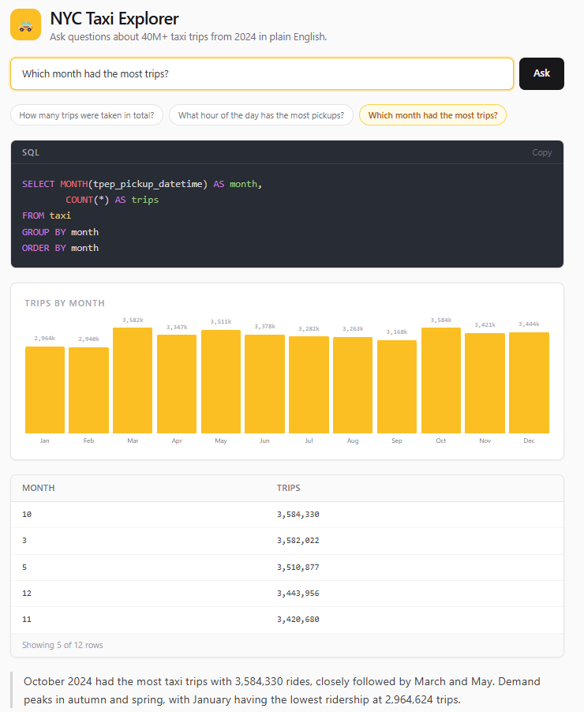

# AI-Powered NL→SQL over NYC Taxi Data

Ask plain-English questions about **41 million NYC taxi trips** (full year 2024) and get back the SQL, the results, an auto-generated chart, and a plain-English explanation — powered by **LLaMA 3.1** (Groq) and **DuckDB**.



---

## How good is it, actually?

Measured, not asserted. `backend/eval/` runs a hand-written golden set of 42
questions and scores **execution accuracy** — a generated query counts as
correct only when its result set matches hand-written reference SQL.

| | Baseline prompt | + few-shot exemplars | + zone lookup |
|---|---|---|---|
| **Execution accuracy** | 64% | 78% | **83%** |
| Valid SQL rate | 100% | 92% | 93% |
| Needed a second attempt | 11 / 36 | 3 / 36 | 3 / 42 |
| Cases | 36 | 36 | 42 |

Full breakdowns by category and difficulty, plus every failure with its
generated SQL: **[docs/eval-report.md](docs/eval-report.md)** (baseline kept at
[docs/eval-report-baseline.md](docs/eval-report-baseline.md)).

**What the baseline got wrong.** Almost never the SQL itself — the valid-SQL
rate was already 100%. The failures were *shape* errors: pivoting "compare A vs
B" into two columns instead of two rows, averaging per-row ratios instead of
dividing the sums, volunteering extra columns nobody asked for. Prose rules in
the system prompt did not fix that; five worked examples did. None of the
exemplar questions appear in the evaluation set, and a test enforces that.

**The tradeoffs are real.** Few-shot prompting cut first-attempt failures from
11 to 3, but the 3 that remain now exhaust their retries instead of recovering,
so the valid-SQL rate fell from 100% to 92%. The longer prompt also costs about
3 seconds of median latency. Accuracy was the right thing to buy with that; a
latency-sensitive deployment might not agree.

**Zone lookup paid for itself.** Joining the TLC zone names into the table
added 6 questions about boroughs and airports — all 6 correct on the first
attempt — while the original 36 scored exactly as before it (28/36). The
alternative was to leave zones in a separate table and let the model write the
joins; see [docs/architecture.md](docs/architecture.md) for why denormalising
won, and what it cost.

**On precision.** Repeated runs of the same cases land within about 3 points of
each other even at temperature 0, so the 64% → 83% improvement is real but
"83% vs 81%" would not be. Forty-two cases is enough to compare two prompts,
not enough to detect a small regression.

`python -m eval.run --check` re-runs every reference query without calling the
LLM, so CI can prove the golden set still matches the schema for free.

---

## Features

- **Natural language → SQL** — type a question, get a DuckDB query back
- **Self-correcting** — when generated SQL fails, the database's error is fed back to the model as a correction turn instead of shown to the user
- **41M rows, lazily** — DuckDB scans a view over 12 monthly Parquet files; nothing is loaded into memory at startup and aggregates return in under half a second
- **Real place names** — the TLC zone lookup is joined in, so you can ask about *JFK Airport* or *Manhattan to Brooklyn* instead of memorising that JFK is `LocationID 132`
- **Four-layer SQL guard** — statement-type validation using DuckDB's own parser, a leading-keyword check, a filesystem-function denylist, and a row cap pushed into the query
- **Response caching** — temperature-0 generation makes questions deterministic, so repeat questions skip both LLM calls entirely
- **Rate limited** — sliding window per IP plus a daily global ceiling, so a public demo can't drain a personal API key
- **Auto-charts** — a stat card for single values, a bar chart for category breakdowns, a line chart for time series
- **Query history** — every successful query is saved to SQLite; click any past query to restore it
- **Column glossary** — all 23 columns in plain English, including what coded values like `payment_type = 1` mean
- **Observable** — `/health` verifies the data is queryable, `/api/metrics` reports cache hit rate, latency percentiles and error counts
- **Fully tested** — 177 backend tests (pytest) + 86 frontend tests (Jest + RTL), plus lint, type-check and Docker builds in CI

---

## How it works

```
question ─► LLM ─► SQL ─► guard ─► DuckDB ─► rows ─► LLM ─► explanation
             ▲                        │
             └──── error message ◄────┘   (self-correction, up to 3 attempts)
```

1. The question hits FastAPI, which checks the response cache first — a hit costs nothing and skips the rest
2. On a miss, the rate limiter decides whether this visitor gets to spend an LLM call
3. LLaMA 3.1 translates the question into DuckDB SQL, guided by the schema, the TLC data dictionary, and five worked examples
4. The SQL guard validates it (single SELECT, no filesystem access) and wraps it with a row cap
5. DuckDB executes it lazily against 12 Parquet files, under a wall-clock timeout
6. If it failed, the error goes back to the model and the loop repeats; otherwise LLaMA writes a short explanation
7. The response is cached, persisted to SQLite for history, and returned

The whole pipeline runs in a worker thread — it is synchronous, and running it
on the event loop would serialise every concurrent request behind it.

See **[docs/architecture.md](docs/architecture.md)** for the design decisions and
their tradeoffs.

---

## Quick start with Docker (recommended)

Requires [Docker Desktop](https://www.docker.com/products/docker-desktop).

```bash
# 1. Clone
git clone https://github.com/atharva2419/AI-Powered-NLP-to-SQL.git
cd AI-Powered-NLP-to-SQL

# 2. Add your Groq API key (free at console.groq.com)
cp .env.example .env    # then edit GROQ_API_KEY

# 3. Start
docker compose up --build
```

Open [http://localhost:3000](http://localhost:3000).

The container downloads a 1M-row sample on first boot if it finds no data, so
this works with nothing pre-arranged. For the full 41M-row dataset, download it
first (12 Parquet files, ~700 MB, resumable):

```bash
python backend/data/download_data.py
```

```bash
# Stop
docker compose down
```

> **Note:** source code is baked into the images at build time, so re-run
> `docker compose up --build` after any code change.

---

## Manual setup (no Docker)

**Prerequisites:** Python 3.11+, Node.js 18+, a free [Groq API key](https://console.groq.com)

```bash
cp .env.example .env    # then edit GROQ_API_KEY

# Backend
cd backend
pip install -r requirements.txt
python data/download_data.py          # or skip — bootstrap samples one month
uvicorn main:app --reload --port 8000

# Frontend (new terminal)
cd frontend
npm install
npm run dev
```

Open [http://localhost:3000](http://localhost:3000).

---

## Running the tests and the eval

```bash
# Backend — 177 tests
pytest backend/tests/ -v
ruff check backend/

# Frontend — 86 tests
cd frontend && npm test && npx tsc --noEmit

# Evaluation
cd backend
python -m eval.run --check            # validate the golden set, no API key needed
python -m eval.run                    # full run, needs GROQ_API_KEY
python -m eval.run --limit 5          # quick smoke run
python -m eval.run --out ../docs/eval-report.md
```

CI runs backend tests + lint + eval validation, frontend tests + lint +
type-check, and both Docker builds, in three parallel jobs.

---

## Deploying

The API and the frontend deploy separately, both on free tiers.

**API** — [`fly.toml`](fly.toml) (Fly.io) or [`render.yaml`](render.yaml) (Render):

```bash
python backend/data/make_sample.py --rows 1000000   # ~25 MB, stratified by month
# upload taxi_sample.parquet as a GitHub Release asset, then:
fly secrets set GROQ_API_KEY=... SAMPLE_DATA_URL=https://.../taxi_sample.parquet
fly deploy
```

The sample is stratified across all 12 months rather than truncated, so
"which month had the most trips?" still has a real answer. If `SAMPLE_DATA_URL`
is unset the container builds its own sample at boot — slower, but it always works.

Rate limiting is on by default in both deploy configs. Set `RATE_LIMIT_PER_HOUR`
and `RATE_LIMIT_GLOBAL_PER_DAY` to bound what a public demo can cost you.

**Frontend** — Vercel, root directory `frontend`, with
`NEXT_PUBLIC_API_URL` pointing at the deployed API. Add that origin to
`CORS_ORIGINS` on the API.

---

## API reference

| Method | Endpoint | Description |
|--------|----------|-------------|
| `POST` | `/api/query` | Translate a question to SQL and run it |
| `GET` | `/api/examples` | Six example questions |
| `GET` | `/api/schema` | All 23 taxi table columns with types |
| `GET` | `/api/history` | Last 20 successful queries (SQLite) |
| `GET` | `/api/metrics` | Cache hit rate, latency percentiles, error counts |
| `GET` | `/health` | Liveness — confirms the taxi view is queryable |

**POST /api/query — request:**
```json
{ "question": "What is the average fare amount?" }
```

**POST /api/query — response:**
```json
{
  "sql": "SELECT ROUND(AVG(fare_amount), 2) AS avg_fare FROM taxi",
  "result": { "columns": ["avg_fare"], "rows": [[18.37]], "row_count": 1, "truncated": false },
  "explanation": "The average fare across all 41M trips in 2024 was $18.37.",
  "latency_ms": 1840,
  "attempts": 1,
  "cached": false
}
```

`attempts > 1` means the model corrected itself. `cached: true` means no LLM
call was made. Errors return `{ "error": "..." }` with status 400 (bad query),
429 (rate limited) or 502 (LLM unavailable).

---

## Example questions

| Question | Generated SQL |
|----------|---------------|
| How many trips were taken in total? | `SELECT COUNT(*) AS total_trips FROM taxi` |
| What is the average fare amount? | `SELECT ROUND(AVG(fare_amount), 2) AS avg_fare FROM taxi` |
| What hour of the day has the most pickups? | `SELECT HOUR(tpep_pickup_datetime) AS hour, COUNT(*) AS trips FROM taxi GROUP BY hour ORDER BY trips DESC LIMIT 1` |
| What percentage of trips are paid by credit card? | `SELECT ROUND(100.0 * SUM(CASE WHEN payment_type = 1 THEN 1 ELSE 0 END) / COUNT(*), 2) AS pct FROM taxi` |
| What is the average trip distance by payment type? | `SELECT payment_type, ROUND(AVG(trip_distance), 2) AS avg_distance FROM taxi GROUP BY payment_type ORDER BY payment_type` |
| Which month had the most trips? | `SELECT MONTH(tpep_pickup_datetime) AS month, COUNT(*) AS trips FROM taxi GROUP BY month ORDER BY trips DESC LIMIT 1` |

---

## Project structure

```
NL-SQL/
├── backend/
│   ├── main.py              # FastAPI — 6 endpoints, caching, rate limiting, request IDs
│   ├── query_engine.py      # LLM → SQL → DuckDB pipeline with self-correction
│   ├── sql_guard.py         # 4-layer validation of model-generated SQL
│   ├── cache.py             # SQLite response cache with TTL
│   ├── ratelimit.py         # per-IP sliding window + global daily budget
│   ├── metrics.py           # in-process counters and latency percentiles
│   ├── history.py           # SQLite query history
│   ├── config.py            # every tunable, read from the environment
│   ├── eval/
│   │   ├── dataset.json     # 42 golden questions with reference SQL
│   │   └── run.py           # execution-accuracy harness + report generator
│   ├── data/
│   │   ├── taxi_zone_lookup.csv  # 265 TLC zones — committed, 12 KB
│   │   ├── download_data.py # fetch the full 12-month dataset
│   │   ├── make_sample.py   # month-stratified sample for deployment
│   │   └── bootstrap.py     # ensure data exists before the API starts
│   └── tests/               # 177 tests
├── frontend/
│   ├── app/page.tsx         # search, results, chart, history, glossary
│   ├── components/ResultChart.tsx
│   ├── lib/{api,chart,glossary}.ts
│   └── __tests__/           # 59 tests
├── docs/
│   ├── architecture.md      # design decisions and tradeoffs
│   └── eval-report.md       # latest accuracy report
├── .github/workflows/ci.yml
├── fly.toml · render.yaml   # API deployment
└── docker-compose.yml
```

---

## Tech stack

| Layer | Technology |
|-------|------------|
| LLM | LLaMA 3.1 8B via [Groq](https://console.groq.com) |
| Query engine | [DuckDB](https://duckdb.org) (in-process, no server) |
| Data | NYC TLC Yellow Taxi Parquet (41M rows, full year 2024, ~700 MB) + the 265-row TLC zone lookup |
| Backend | Python · FastAPI · Pydantic |
| Storage | SQLite (history + response cache) |
| Frontend | Next.js 16 · React 19 · Tailwind CSS v4 |
| Charts | [Recharts](https://recharts.org) |
| Tests | pytest · Jest · React Testing Library · ruff · ESLint |
| CI | GitHub Actions (tests, lint, type-check, Docker builds) |
| Deploy | Fly.io / Render (API) · Vercel (frontend) |

---

## License

[MIT](LICENSE)
